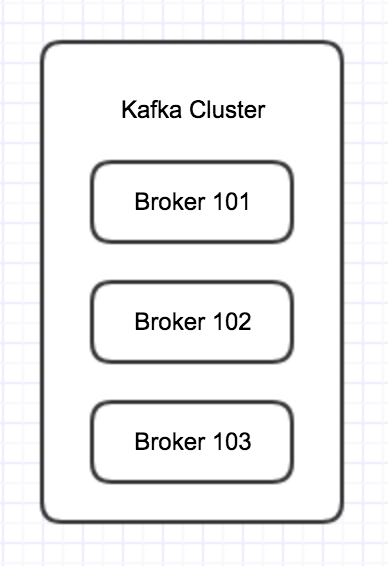
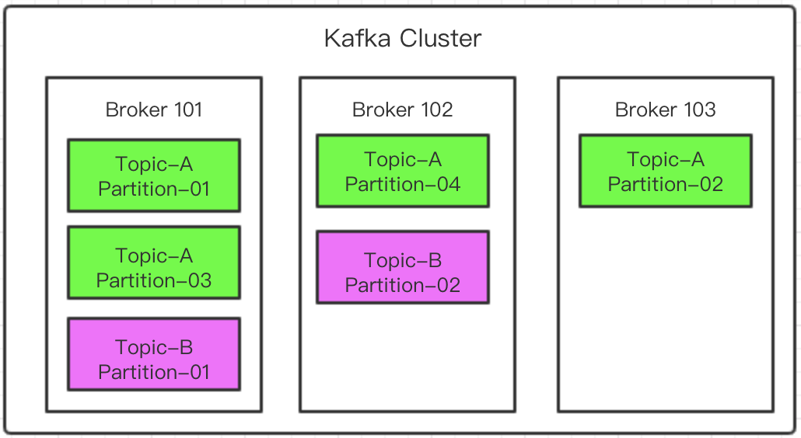

#### 一.broker的概念

* 一个kafka服务器就称为一个broker
* 多个Broker组成一个Cluster，在一个Cluster里，Broker的个数是没有限制的。

	A Kafka Cluster is composed of multiple brokers(Server)

* 在Cluster里，每一个broker都有一个唯一的ID，这个ID只能是数字。
* 每一个Broker会包含topic(主题)的分区(partitions)
* 当连接到了任意一个Broker(此时称为bootstrap Broker)，就会连接到整个Cluster

#### 二.broker和topic的关系

如上图所示，现在有3个broker，topic-A分成了4个partition，那么这4个分区就会分别分布在3个broker里，不会存在4个分区全在一个broker里，也不会存在一个broker里没有topic-A的分区。当主题的分区数比broker数少的时候，就会存在在某些broker里面没有该主题分区的现象，例如图中的ropic-B。

同时，分区的序号跟broker的序号没有任何关系。