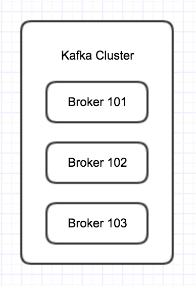

#### 一.broker的概念

一个kafka服务器就称为一个broker。

* 多个Broker组成一个Cluster，在一个Cluster里，Broker的个数是没有限制的。

	A Kafka Cluster is composed of multiple brokers(Server)

* 在Cluster里，每一个broker都有一个唯一的ID，这个ID只能是数字。
* 每一个Broker会包含topic(主题)的分区(partitions)
* 当连接到了任意一个Broker(此时称为bootstrap Broker)，就会连接到整个Cluster
* 

