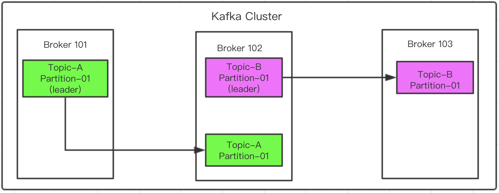

#### 一.Topic Replication Factor

topics应该有一个主题备份因子，这个因子要大于1，通常情况下是介于2到3之间的，也就是说应该为2或者为3.

- 如果备份因子是2的话，就表示一个分区会在别的broker里面产生一个数据完全一样的备份，在整个cluster里面就会有2份该分区的数据；如果是3的话，就表示会在别的两个broker中分别生成一份相同的数据，在cluster中同时会存在3份该数据。

- 出现备份因子的原因是，当其中一个broker出现损坏，无法正常读取数据的时候，在别的broker中该数据的备份可以继续存储数据。
- 对于同一份数据，如果出现别的数据备份，在同一时间，在这些多分数据中，只有一份数据可以作为leader，leader就是当前活动的数据备份。例如broker 101和broker102中都有topic-A主题的partition-01这个数据，broker 101中的数据是leader，broker 102中的数据是这份数据的备份，所以当consumer要读取该数据的时候，实际读取的是broker 101中的partition-01数据，并不会去读取broker 102中的partition-01。但是当leader数据(broker101中的topic-A主题partition-01分区)所在的broker出现损坏的时候，broker102中的备份的topic-A主题partition-01分区就会成了leader，然后consumer可以从中读取数据。当broker101可以使用的时候，其中的topic-A主题partition-01分区就又会变成leader。
- 备份数据会不断的同步leader中的数据。
- 也就是说，每一个分区都包含一个leader分区，还有另外的多份ISR(in-sync replica)分区

