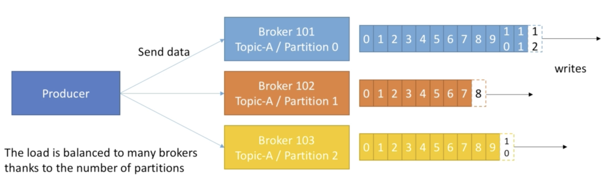

####一.Producer发送消息

- 数据由Producer发送到Topics
- Producer会自己决定发送到哪一个Broker
- 如果Broker发生了错误，Producer将会自己恢复数据

####二.acknowledgment设置

Producer可以通过设置acks的值来决定是否接受Broker接受数据的情况。

- acks=0，表示Producer不会接受Broker对从Producer发来的数据的响应，这种情况下如果存在丢失数据的情况(比如Broker出现了损坏)，Producer是不会知道的。
- acks=1(默认)，表示Producer会接受存储leader数据的Broker回应，这样可以从某种程度上保证数据的安全性。例如Broker101中的Topic-A的Partition0是leader数据，当Broker接收到该数据的时候，Broker就会给Producer作出相应，表示Broker接收到了该数据。
- acks=all，表示Producer会接受存储leader数据以及其他所有存储replication数据的Broker的相应，这样可以最大程度保证数据的安全性。

#### 三.Message Key

Producer在发送Message的时候可以选择是否发送Message Key

- Key的数据类型没有特定的限制，可以是任何类型的(String, int)
- 如果没有发送Key(Key=null)，Producer向Broker发送数据将采用round robin(轮训)的方式，上一次发送给了Broker101，下一次发送给Broker102，在之后发送给Broker103，之后再发送给Broker101，这样可以保证Broker的平衡性(load balance)
- 如果发送了key，在第一次发送该数据的时候，Producer将随机选择发送给哪一个partition，之后如果带有该key的数据再次发送过来，Producer将始终将带有这个Key的数据发送给同一个partition。