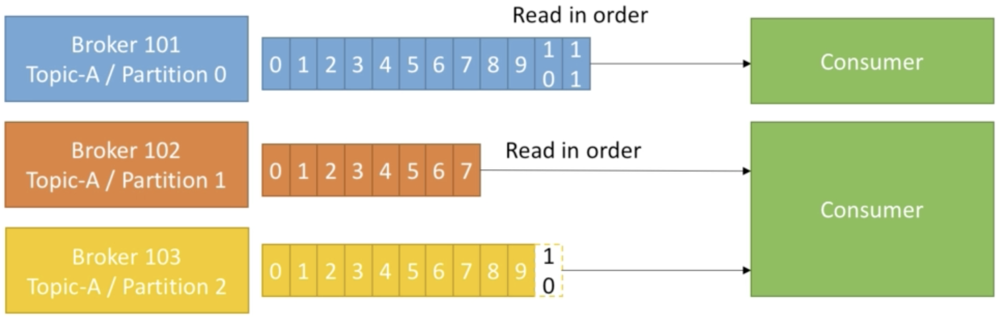
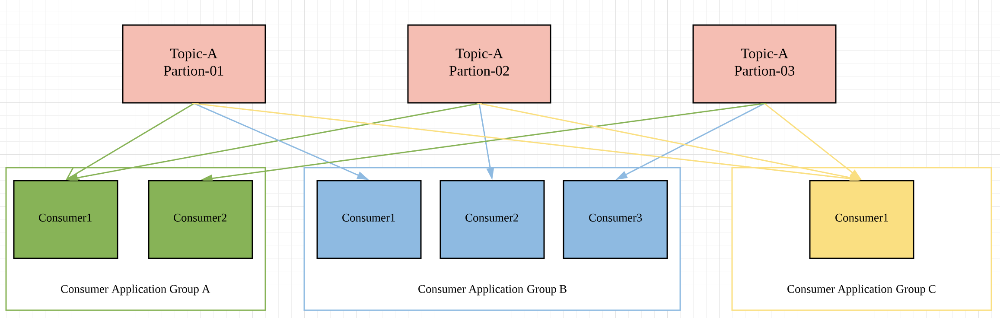
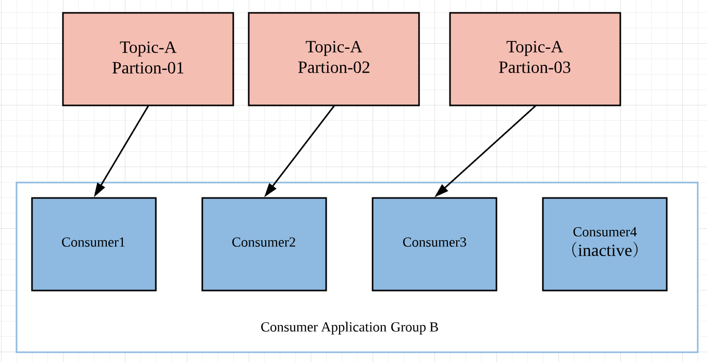

#### 一.Consumer从分区中读取数据

- Consumer从partion中读取数据
- Consumer自己判断到底该从哪个partition中读取数据
- 当存放数据的Broker出现损坏的时候，Consumer可以通过读取replication的方式来恢复数据
- 对于同一个分区，Consumer读取数据的顺序是一定的，比如对于topic-A的partion0来说，是按照offset0，offset1，offset2的顺序来读取数据的。
- 一个Consumer可以同时从多个分区读取数据(如上图所示)，当从多个partion中读取数据的时候，并没有特定的顺序要从哪个分区中读取数据。但是同一个分区中的数据读取是有顺序的。

#### 二.Consumer Group读取数据

- Consumer读取数据的时候，是以Consumer Group的形式读取数据，当然这个Consumer Group中可能只有一个Cunsumer。
- Consumer Group会读取相同主题的所有分区。如上图所示，Consumer Application A中有两个Consumer，但是需要读取三个分区中的数据，其中有一个Consumer就会读取两个分区中的数据。
- 当在一个Consumer Group中，Consumer的个数多于topic中partition的时候，多出来的数量的Consumer就会处于inactive状态。

