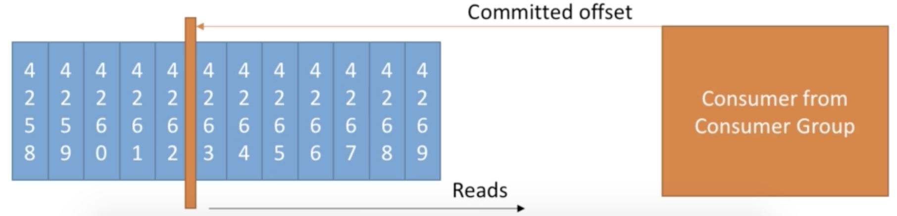

#### 一.Consumer Offset

- Kafka会保存Consumer Group读取的数据的偏移量
- 读取的数据的偏移量保存在Kafka的topic中，命名为__consumer_offsets
- 当一个Consumer Group中的Consumer处理了来自Kafka的数据的时候，应该保存该Consumer处理的数据的偏移量
- 当一个Consumer出现问题的时候，在下次继续运行的时候，他可以通过保存的读取数据的偏移量，来继续读取之后的数据。如上图，当读取到4262的时候，Consumer出现了问题，下次Consumer重新读取数据的时候，就会从4263开始往后读取数据。

#### 二.Consumer何时提交偏移量

Consumer可以选择什么时候提交偏移量，有以下3中情况。

- At most once:

  当Consumer从partition那里读取到数据的时候，就提交偏移量。

  这种情况存在的问题就是，当Consumer处理该数据出现问题的时候，数据就会消失，并且无法再次读取数据。

- At lease once:

  偏移量会在数据被Consumer处理完的时候提交。

  如果Consumer处理数据的时候出现了问题，这个数据会被再次读取。这样的话，对于同一份数据，Consumer可能会重复处理，需要确保重复处理的数据，不会对自己的系统有影响。

- Exactly once:

       这个功能的实现，需要利用Kafka Stream API，实现Kafka和Kafka之间的工作流。