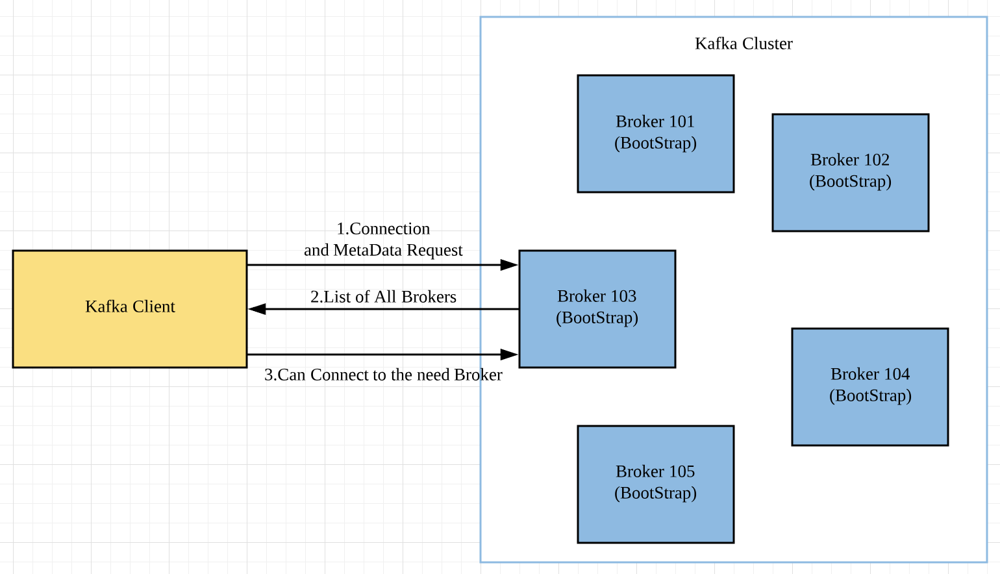

#### 一.Kafka Broker Discovery

- 在Kafka Cluster中，每一个Broker都被称为BootStrap Server(引导服务器)。
- Kafka客户端在发出Broker连接请求的同时，还会发出MetaData的请求，任意一个Broker在接到Kafka的连接请求之后，会将Cluster中所包含的所有的Broker的List都返回给该客户端，这样客户端就会得到所有Broker的相关信息(Broker ID和IP等)。
- 每一个Broker都知道其他所有的Broker，也知道所有的Topic和partition(metadata)