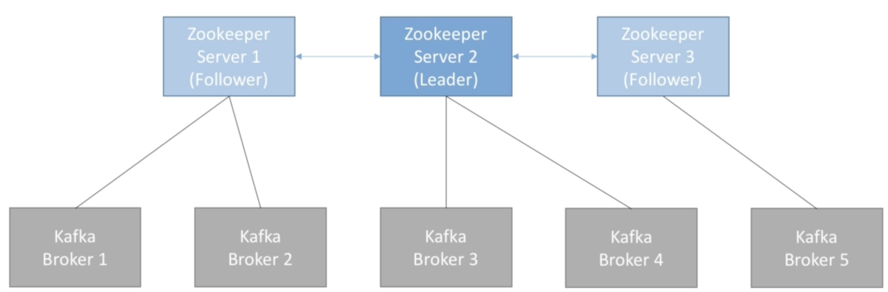

#### 一.Zookeeper

- zookeeper用来管理brokers(Keep a list of all brokers)
- zookeeper可以帮助选出leader partition
- 当Kafka出现变化的时候，zookeeper会给Kafka发送通知，例如出现了新的topic，broker不能正常工作了等等
- 如果没有zookeeper的话，Kafka无法正常工作
- zookeeper被设计成只有奇数个服务器(3，5，7)
- zookeeper中也有leader server，leader server负责写入操作，剩下的被称为follower server，follower server负责读操作
- zookeeper并不负责存储consumer offset，consumer offset保存在kafka topic中